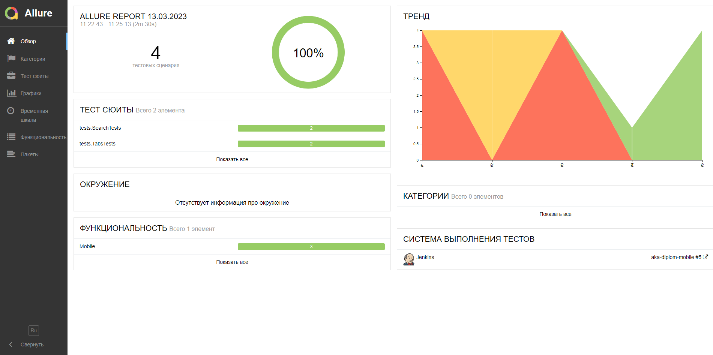
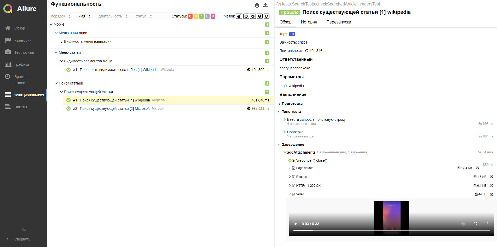
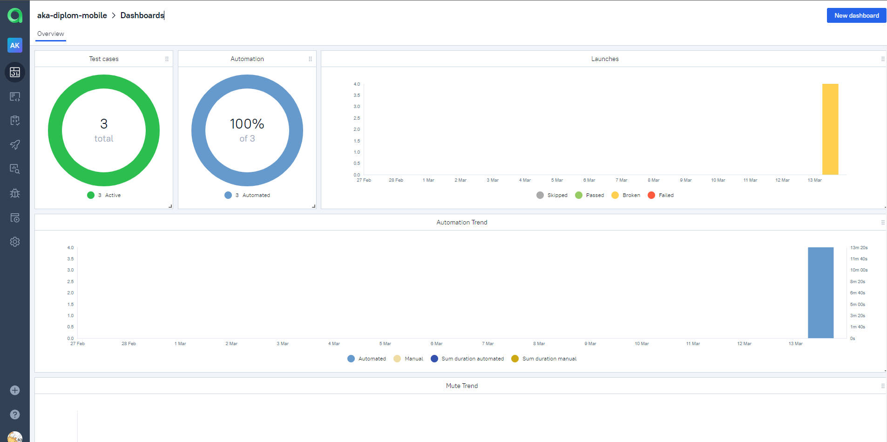
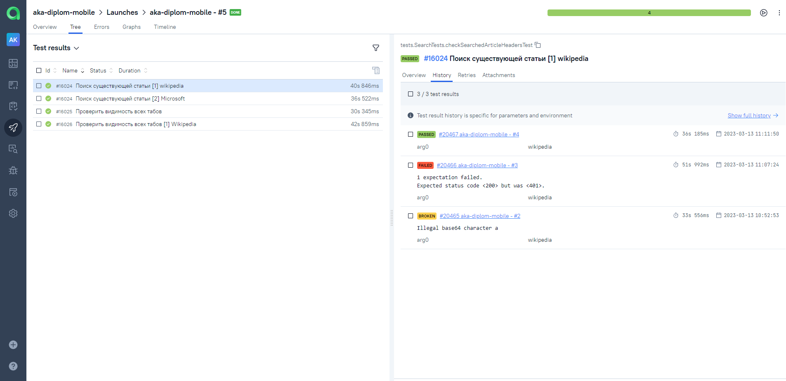
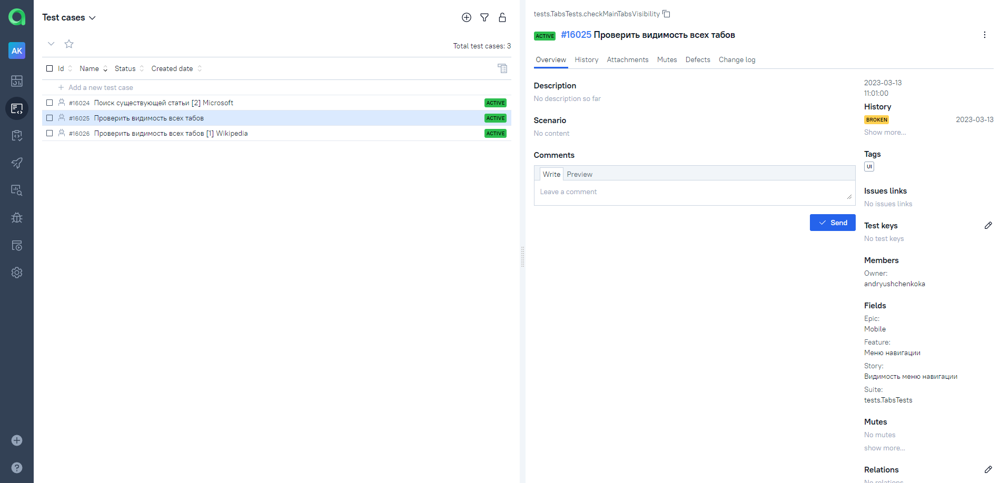
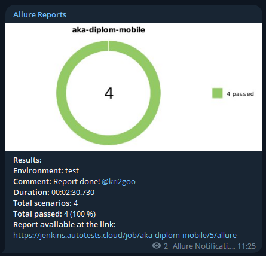

# Дипломный проект по тестированию мобильного приложения [Wikipedia](https://reqres.in/)

## :open_book: Содержание:

- [Технологии и инструменты](#gear-технологии-и-инструменты)
- [Тест кейсы](#heavy_check_mark-Тест-кейсы)
- [Запуск тестов](#computer-запуск-тестов-из-терминала)
- [Примеры использования](#примеры-использования)
- [Запуск тестов в Jenkins](#-запуск-тестов-из-jenkins)
- [Отчет о результатах тестирования в Allure Report](#-отчет-о-результатах-тестирования-в-Allure-report)
- [Интеграция с Allure TestOps](#-интеграция-с-allure-testops)
- [Уведомления в Telegram](#-уведомления-в-telegram)
- [Видео пример прохождения тестов](#-видео-пример-прохождения-тестов)

## :gear: Технологии и инструменты

<p align="left">
<a href="https://www.jetbrains.com/idea/"></a>
<a href="https://www.java.com/"></a>
<a href="https://github.com/"></a>
<a href="https://junit.org/junit5/"></a>
<a href="https://gradle.org/"></a>
<a href="https://selenide.org/"></a>
<a href="https://developer.android.com/studio/"></a>
<a href="https://appium.io/"></a>
<a href="https://github.com/allure-framework/allure2"></a>
<a href="https://www.jenkins.io/"></a>
<a href="https://www.browserstack.com/"></a>
<a href="https://web.telegram.org/"></a>
<a href="https://qameta.io/"></a>
</p>

В данном проекте для написания автотестов на **Java** использовалась библиотека **Appium**. Для сборки проекта в среде **IntelliJ IDEA** использовался **Gradle**.
Применены аннотации **JUnit5** для параметризованных тестов.

**Allure Report**, **AllureTestOps** и **Telegram Bot** используются для визуализации результатов тестирования.

## :heavy_check_mark: Тест кейсы

- Поиск существующей статьи
- Проверка видимости табов навигационного меню
- Проверка видимости табов меню действий над статьей

## :computer: Запуск тестов

Локально и удаленно тесты запускаются одной командой:

```bash
./gradlew clean test "-Denv=${environment}"
```

## Примеры использования

### Для запуска необходимо передать значение:

* environment (окружение выполнения тестов, по умолчанию: local)

##  Запуск тестов из [Jenkins](https://jenkins.autotests.cloud/job/aka-diplom-mobile/)
Для запуска сборки необходимо перейти в раздел <code><strong>*Собрать с параметрами*</strong></code> и нажать кнопку <code><strong>*Собрать*</strong></code>.

<p align="center">
  
</p>

После выполнения сборки, в блоке <code><strong>*История сборок*</strong></code> напротив номера сборки появится
значок *Allure Report* и *Allure TestOps* кликнув по которому, откроется страница с сформированным html-отчетом и тестовой документацией.

##  Отчет о результатах тестирования в [Allure Report](https://jenkins.autotests.cloud/job/aka-diplom-mobile/5/allure/)

<p align="center">
  
</p>

<p align="center">
  
</p>

##  Интеграция с [Allure TestOps](https://allure.autotests.cloud/launch/20468)

### Основной дашборд

<p align="center">
  
</p>

### Список тестов с результатами прогона

<p align="center">
  
</p>

### Тест-кейсы

<p align="center">
  
</p>

##  Уведомления в Telegram
После завершения сборки специальный бот, созданный в <code>Telegram</code>, автоматически обрабатывает и отправляет сообщение с отчетом о прогоне тестов.

<p align="center">


## Видео пример прохождения тестов
<p align="center">
  
</p>
